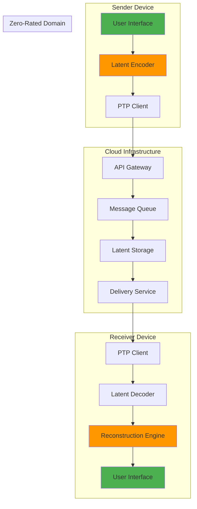
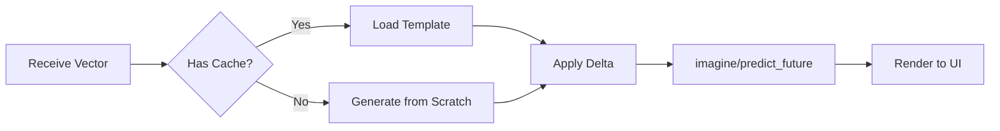
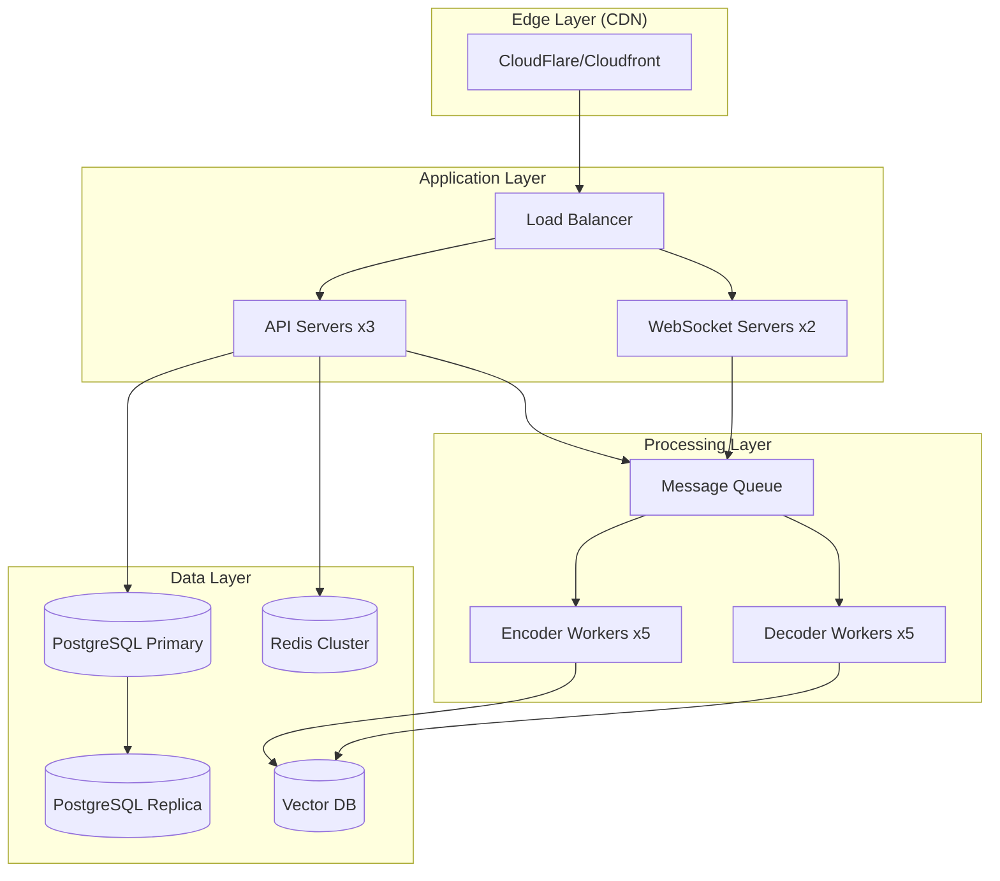
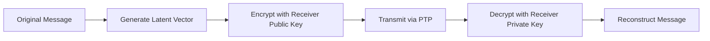
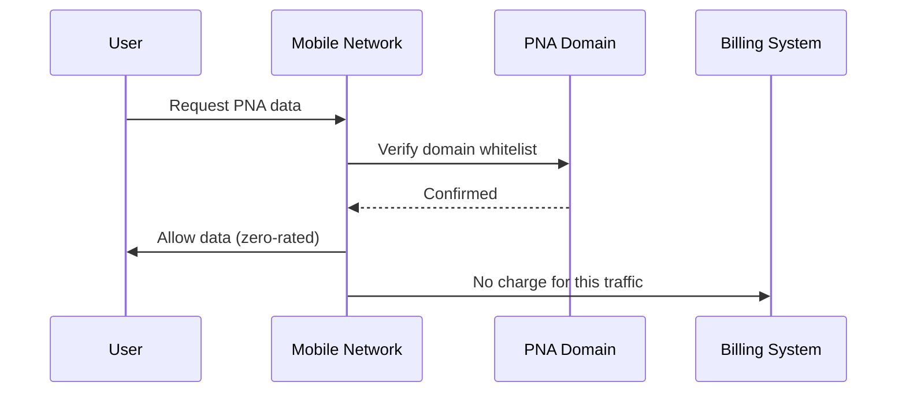
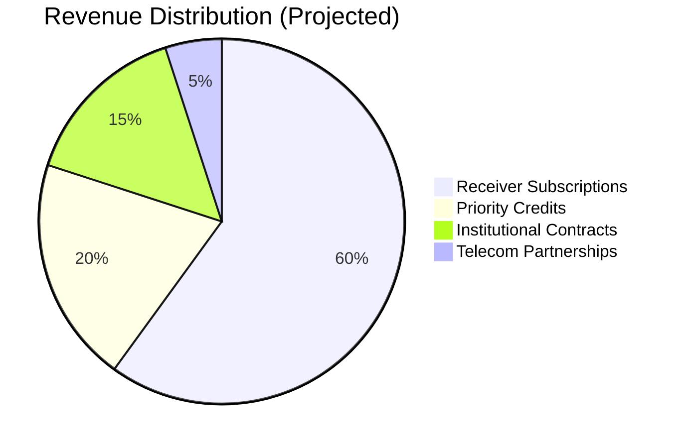
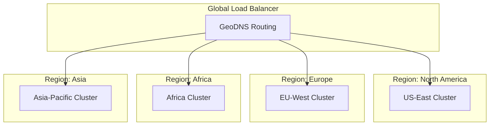
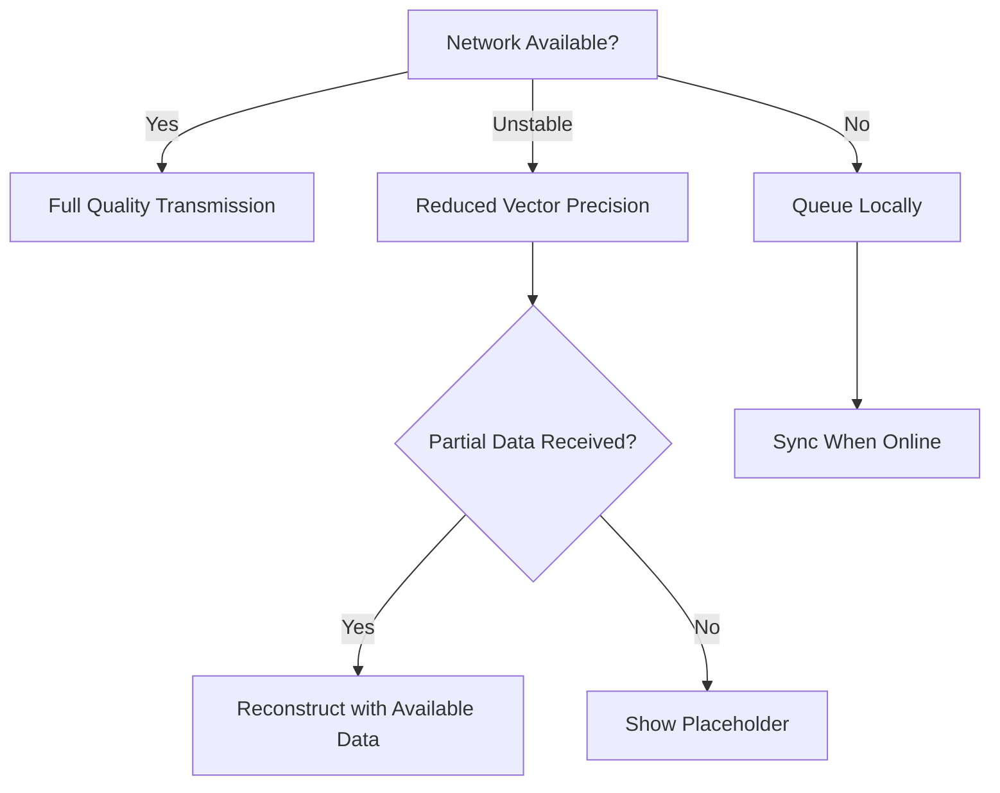

# Paradox Network Application (PNA)

## Complete Technical & Product Documentation

> [!IMPORTANT]
> **PNA revolutionizes mobile communication by transmitting semantic meaning (latent vectors) instead of raw data, enabling zero-cost receiving in ultra-low bandwidth environments.**

---

## Table of Contents

1. [Executive Overview](#1-executive-overview)
2. [Core Philosophy](#2-core-philosophy)
3. [System Architecture](#3-system-architecture)
4. [User Roles & Cost Model](#4-user-roles--cost-model)
5. [Message Types](#5-message-types-latent-classification)
6. [Paradox Transport Protocol](#6-paradox-transport-protocol-ptp)
7. [Latent Reconstruction Engine](#7-latent-reconstruction-engine)
8. [Technical Implementation](#8-technical-implementation)
9. [API Specifications](#9-api-specifications)
10. [Security & Privacy](#10-security--privacy)
11. [Telecom Integration](#11-telecom-integration-zero-rating)
12. [Monetization Model](#12-monetization-model)
13. [Scalability & Distribution](#13-scalability--distribution)
14. [Data Models](#14-data-models)
15. [Offline & Network Resilience](#15-offline--network-resilience)
16. [Compliance & Ethics](#16-compliance--ethics)
17. [MVP Definition](#17-mvp-definition)
18. [Implementation Roadmap](#18-implementation-roadmap)
19. [Long-Term Vision](#19-long-term-vision)

---

## 1. Executive Overview

**Paradox Network Application (PNA)** is a next-generation communication platform built on the **Paradox Latent Framework (ParadoxLF)**. While the user experience mirrors familiar messaging apps (Telegram, WhatsApp), the underlying system operates on a fundamentally different paradigm: **latent semantic transmission instead of raw data transfer**.

### Key Differentiators

- **99% bandwidth reduction** compared to traditional messaging
- **Zero-cost receiving** through telecom partnerships
- **Works in 2G/EDGE** networks where others fail
- **Nation-scale deployment** ready from day one
- **Social impact focus** - no ads, no data selling

### Target Markets

1. **Emerging Markets**: Areas with expensive or unreliable data connectivity
2. **Rural Communities**: Villages and remote regions
3. **Emergency Services**: National disaster response systems
4. **Educational Institutions**: Low-bandwidth e-learning platforms
5. **Healthcare**: Telemedicine in resource-constrained settings

---

## 2. Core Philosophy

### 2.1 Familiar UI, Invisible Complexity

- Users interact with a **simple, intuitive messaging interface**
- **Zero exposure** to AI, vectors, simulations, or latent concepts
- All technical complexity is **fully abstracted** into the backend engine

### 2.2 Extreme Efficiency Through Abstraction

Traditional messaging transmits:
- Raw images (2-10 MB)
- Video files (50-500 MB)
- Audio recordings (1-5 MB)

**PNA transmits instead:**
- **Latent vectors** (512 bytes - 4 KB)
- **Semantic deltas** (256 bytes)
- **Temporal projections** (1 KB)

**Reconstruction occurs on the receiver side using ParadoxLF.**

### 2.3 Design Principles

1. **Semantic Fidelity**: Preserve meaning, not pixels
2. **Graceful Degradation**: Partial data → partial meaning (not broken)
3. **User-Centric**: Technical innovation invisible to end users
4. **Privacy by Design**: Minimal metadata, maximal encryption
5. **Sustainable Economics**: Fair pricing, no exploitation

---

## 3. System Architecture

### 3.1 High-Level Architecture



### 3.2 Component Breakdown

#### Frontend (Mobile App)
- **Technology**: React Native / Flutter
- **Responsibilities**: UI/UX, local caching, encoding initiation
- **Offline Support**: Queue management, sync on reconnect

#### Backend (Cloud Services)
- **Technology**: FastAPI (Python) / Node.js
- **Services**: Authentication, message routing, billing
- **Database**: PostgreSQL (metadata) + Vector DB (Pinecone/Weaviate)

#### Latent Engine
- **Core**: ParadoxLF framework
- **Models**: CLIP (vision), SentenceTransformers (text)
- **Compute**: GPU-accelerated when available, CPU fallback

---

## 4. User Roles & Cost Model

### 4.1 Sender

**Characteristics**:
- Uses personal mobile data or Wi-Fi
- Initiates communication
- Pays standard data cost (minimal due to latent compression)

**Optional Features**:
- Purchase priority credits for urgent messages
- Broadcast to multiple receivers (premium)

**Typical Costs**:
- Regular message: ~2 KB data usage
- Priority message: ~5 KB + microtransaction fee

### 4.2 Receiver

**Characteristics**:
- Pays fixed monthly subscription ($2-5/month)
- **Uses ZERO mobile data** for receiving
- Unlimited message reception
- Works in any coverage area

**Benefits**:
- No surprise data charges
- Works in low-connectivity areas
- Predictable monthly cost

### 4.3 Dual Role (Hybrid Users)

- Subscription enables receiving privileges
- Sending uses minimal sender-side data
- Can toggle between modes seamlessly

---

## 5. Message Types (Latent Classification)

All messages are categorized by **semantic intent**:

| Intent Type | Description | Vector Size | Use Case |
|------------|-------------|-------------|----------|
| **Textual Intent** | Semantic meaning of text | 512-1024D | Normal chat messages |
| **Visual Intent** | Image concepts via CLIP | 512D | Photo sharing |
| **Audio Intent** | Speech-to-semantic | 768D | Voice messages |
| **Situational State** | Context sharing | 256D | Location, status updates |
| **Temporal Update** | Change over time | 512D | Live updates |
| **Emergency Alert** | Priority broadcast | 256D | Urgent notifications |

> [!NOTE]
> Raw media is **never transmitted** unless the user explicitly requests "HD mode" (paid feature).

---

## 6. Paradox Transport Protocol (PTP)

### 6.1 Protocol Design

PTP is a **lightweight, semantic-aware transport protocol** designed for extreme efficiency.

### 6.2 Payload Structure

```json
{
  "version": "1.0",
  "message_id": "uuid-v4",
  "sender_id": "user123",
  "receiver_id": "user456",
  "timestamp": 1706295600,
  "intent_type": "visual",
  "latent_vector": [0.234, -0.567, ...],  // 512 floats
  "temporal_delta": null,
  "priority": 0,
  "integrity_hash": "sha256:abc123...",
  "encrypted": true,
  "metadata": {
    "original_format": "image/jpeg",
    "reconstruction_hint": "outdoor_scene"
  }
}
```

### 6.3 Compression Strategy

1. **Vector Quantization**: 32-bit → 8-bit floats (75% reduction)
2. **Sparsification**: Remove near-zero values
3. **Differential Encoding**: Send only changes for sequential messages
4. **gzip Compression**: Final payload compression

**Result**: Typical 512D vector → **1-4 KB** transmitted

### 6.4 Priority Levels

| Level | Name | Queue Time | Cost Multiplier |
|-------|------|------------|----------------|
| 0 | Normal | Up to 30s | 1x |
| 1 | High | Up to 5s | 2x |
| 2 | Urgent | Up to 1s | 5x |
| 3 | Emergency | Immediate | 10x |

---

## 7. Latent Reconstruction Engine

### 7.1 Reconstruction Pipeline



### 7.2 Core Operations

#### Text Reconstruction
```python
# Decode semantic vector back to nearest text concept
text = engine.conceptual_search(received_vector, k=1)[0]
```

#### Image Reconstruction
```python
# Generate image from CLIP latent space
image = engine.imagine(received_vector, mode="visual")
```

#### Temporal Prediction
```python
# Predict next frame in a sequence
next_frame = engine.predict_future(
    history=[vector_t1, vector_t2, vector_t3],
    steps=1
)
```

### 7.3 Deterministic Rendering

- **Same vector** → **Same output** (cached when possible)
- **Progressive enhancement**: Low-res → High-res as more data arrives
- **Bandwidth-aware**: Automatically adjusts quality to network speed

---

## 8. Technical Implementation

### 8.1 Technology Stack

#### Backend
- **Framework**: FastAPI (Python 3.10+)
- **Database**: PostgreSQL 15 + Redis (caching)
- **Vector Store**: Pinecone / Weaviate
- **Message Queue**: RabbitMQ / AWS SQS
- **Authentication**: JWT + OAuth2

#### Mobile App
- **Framework**: Flutter 3.x (iOS + Android)
- **State Management**: Riverpod / BLoC
- **Local Storage**: SQLite + Hive
- **Networking**: Dio + WebSocket

#### AI/ML Layer
- **Core Engine**: ParadoxLF (existing framework)
- **Vision**: CLIP (OpenAI)
- **Text**: SentenceTransformers
- **Deployment**: TorchServe / TFServing

### 8.2 Infrastructure



---

## 9. API Specifications

### 9.1 Authentication Endpoints

#### POST /api/auth/register
```json
{
  "phone_number": "+1234567890",
  "verification_code": "123456",
  "device_id": "uuid"
}
```

#### POST /api/auth/login
```json
{
  "phone_number": "+1234567890",
  "password": "hashed_password"
}
```

### 9.2 Messaging Endpoints

#### POST /api/messages/send
```json
{
  "receiver_id": "user456",
  "intent_type": "textual",
  "content": "Hello, how are you?",
  "priority": 0
}
```

**Response**:
```json
{
  "message_id": "msg_123",
  "status": "queued",
  "estimated_delivery": "2024-01-26T20:05:00Z",
  "data_used_bytes": 2048
}
```

#### GET /api/messages/receive
```json
{
  "user_id": "user456",
  "since": "2024-01-26T19:00:00Z",
  "limit": 50
}
```

#### WebSocket /ws/messages
```javascript
// Real-time message updates
ws.send({
  "action": "subscribe",
  "user_id": "user456"
});

// Receive messages
ws.onmessage = (event) => {
  const message = JSON.parse(event.data);
  // Reconstruct and display
};
```

### 9.3 Subscription Management

#### GET /api/subscription/status
```json
{
  "user_id": "user456",
  "plan": "receiver_basic",
  "status": "active",
  "expires_at": "2024-02-26T00:00:00Z",
  "auto_renew": true
}
```

#### POST /api/subscription/purchase
```json
{
  "plan": "receiver_premium",
  "payment_method": "telecom_billing"
}
```

---

## 10. Security & Privacy

### 10.1 End-to-End Encryption



**Encryption Algorithm**: AES-256-GCM for vectors + RSA-4096 for key exchange

### 10.2 Privacy Measures

- **Minimal Metadata**: Only message_id, timestamp, sender/receiver IDs stored
- **No Content Logging**: Latent vectors are ephemeral
- **Automatic Deletion**: Messages purged after 30 days (configurable)
- **Zero-Knowledge Architecture**: Server cannot reconstruct messages

### 10.3 Abuse Prevention

| Threat | Mitigation |
|--------|------------|
| Spam | Rate limiting (10 msg/min for free tier) |
| Phishing | Sender verification badges |
| DDOS | CloudFlare protection + adaptive throttling |
| Account Takeover | 2FA via SMS/TOTP |
| Data Mining | No analytics on message content |

---

## 11. Telecom Integration (Zero-Rating)

### 11.1 How Zero-Rating Works



### 11.2 Telecom Integration Requirements

#### Technical Requirements
- **Domain Whitelisting**: `api.paradoxnetwork.com`, `cdn.paradoxnetwork.com`
- **IP Range**: Fixed IPv4/IPv6 blocks
- **Traffic Profiling**: Predictable patterns for DPI (Deep Packet Inspection)
- **Bandwidth Cap**: 5 KB/message average
- **Certificate Pinning**: Prevent man-in-the-middle

#### Business Requirements
- Revenue sharing agreement (20-30% to telecom)
- SLA guarantees (99.9% uptime)
- Subscriber reporting (monthly active users)
- Compliance with local regulations

### 11.3 Zero-Rating Regulatory Approval

**Justification for Regulators**:
1. **Social Good**: Enables communication for underserved populations
2. **Fixed Bandwidth**: No network congestion risk
3. **No Competitive Discrimination**: Available to all users equally
4. **Educational Use**: Supports distance learning
5. **Emergency Services**: Critical infrastructure component

---

## 12. Monetization Model

### 12.1 Revenue Streams



### 12.2 Pricing Tiers

#### Individual Plans

| Plan | Price/Month | Features |
|------|-------------|----------|
| **Sender (Free)** | $0 | Send messages (uses your data) |
| **Receiver Basic** | $2 | Unlimited receive, zero data cost |
| **Receiver Premium** | $5 | + Priority sending, + HD media mode |
| **Unlimited** | $10 | Unlimited send + receive, all features |

#### Institutional Plans

| Sector | Price | Scale |
|--------|-------|-------|
| **Education** | $500/month | Up to 1,000 users |
| **Healthcare** | $1,000/month | Up to 500 providers |
| **Government** | Custom | Nation-wide deployment |
| **NGO** | $200/month | Subsidized pricing |

### 12.3 Priority Credits

- **Microtransactions**: $0.05 - $0.50 per priority message
- **Bundles**: 10 credits for $1, 100 for $5
- **Use Cases**: Emergency alerts, time-sensitive business communication

---

## 13. Scalability & Distribution

### 13.1 Horizontal Scaling Strategy

**Latent Sharding** using ParadoxLF distributed memory:

```python
from paradox.distributed import LatentCluster

# Create cluster with 10 shards
cluster = LatentCluster(num_shards=10)

# Distribute user messages across shards
for user_id in users:
    shard_id = hash(user_id) % 10
    cluster.shards[shard_id].add(user_messages[user_id])
```

### 13.2 Geographic Distribution



### 13.3 Performance Targets

| Metric | Target | Measurement |
|--------|--------|-------------|
| **Message Latency** | < 2s (90th percentile) | End-to-end delivery |
| **API Response Time** | < 200ms | Server-side processing |
| **Reconstruction Time** | < 500ms | Client-side rendering |
| **Bandwidth per Message** | < 5 KB | Network transmission |
| **Concurrent Users** | 10M+ | Per regional cluster |

---

## 14. Data Models

### 14.1 User Model

```python
class User(BaseModel):
    user_id: str  # UUID
    phone_number: str  # E.164 format
    username: str
    role: Enum["sender", "receiver", "hybrid"]
    subscription_tier: str
    subscription_expires: datetime
    device_ids: List[str]
    public_key: str  # RSA public key for E2E encryption
    created_at: datetime
    last_active: datetime
```

### 14.2 Message Model

```python
class Message(BaseModel):
    message_id: str
    sender_id: str
    receiver_id: str
    intent_type: Enum["textual", "visual", "audio", "situational", "temporal", "emergency"]
    latent_vector: List[float]  # 512D vector
    temporal_delta: Optional[List[float]]
    priority: int  # 0-3
    integrity_hash: str
    encrypted_payload: bytes
    timestamp: datetime
    delivered_at: Optional[datetime]
    read_at: Optional[datetime]
    status: Enum["queued", "sent", "delivered", "read", "failed"]
```

### 14.3 Subscription Model

```python
class Subscription(BaseModel):
    subscription_id: str
    user_id: str
    plan: str
    status: Enum["active", "suspended", "cancelled", "expired"]
    start_date: datetime
    end_date: datetime
    auto_renew: bool
    payment_method: str
    billing_provider: str  # "telecom", "stripe", "manual"
```

---

## 15. Offline & Network Resilience

### 15.1 Graceful Degradation



### 15.2 Offline Capabilities

**Sender**:
- Queue up to 1,000 messages locally
- Auto-send when connectivity restored
- Show queue status in UI

**Receiver**:
- Cache last 30 days of messages
- Search cached messages offline
- Preload frequent contacts' latent templates

### 15.3 Bandwidth-Adaptive Behavior

| Network Type | Vector Precision | Quality Level |
|-------------|------------------|---------------|
| 4G/5G/WiFi | Full (32-bit floats) | HD |
| 3G | Reduced (16-bit floats) | Standard |
| 2G/EDGE | Quantized (8-bit) | Low |
| Offline | Cached only | Cached |

---

## 16. Compliance & Ethics

### 16.1 Data Protection (GDPR/CCPA)

- **Right to Access**: Users can export all their data
- **Right to Deletion**: Complete account + message deletion
- **Right to Portability**: Message history exportable as JSON
- **Data Minimization**: Only essential metadata stored
- **Purpose Limitation**: Data used only for communication

### 16.2 Ethical Commitments

> [!NOTE]
> **No Ads. No Tracking. No Data Selling.**

- Zero third-party analytics
- No behavioral profiling
- No content analysis for advertising
- Open-source client code (auditable)
- Regular third-party security audits

### 16.3 Content Moderation

- **User-Reported Abuse**: Flagging system
- **Automated Scanning**: Only for illegal content hashes (CSAM)
- **Transparency Reports**: Quarterly publication
- **Appeals Process**: Human review for account suspensions

---

## 17. MVP Definition

### 17.1 Must-Have Features (v1.0)

#### Core Functionality
- ✅ User registration & authentication
- ✅ One-to-one text messaging
- ✅ One-to-one image sharing
- ✅ Latent encoding/decoding pipeline
- ✅ Receiver subscription system
- ✅ Zero-rated domain setup

#### Platform Support
- ✅ Android app (Flutter)
- ✅ iOS app (Flutter)
- ✅ Backend API (FastAPI)
- ✅ Basic admin dashboard

### 17.2 Deferred to v2.0+

- ❌ Group chats
- ❌ Broadcast channels
- ❌ Voice calls / Video calls
- ❌ Audio message intents
- ❌ File sharing (documents, PDFs)
- ❌ Desktop applications
- ❌ Web interface

### 17.3 Success Metrics

| KPI | Target (6 months) |
|-----|-------------------|
| Active Users | 10,000 |
| Message Volume | 1M/day |
| Bandwidth Savings | 95% vs WhatsApp |
| Subscriber Retention | 80% |
| Net Promoter Score | 60+ |

---

## 18. Implementation Roadmap

### Phase 1: Foundation (Weeks 1-4)
- Set up development environment
- Design database schema
- Build authentication system
- Create basic mobile app shell

### Phase 2: Core Engine (Weeks 5-8)
- Integrate ParadoxLF framework
- Implement latent encoder/decoder
- Build PTP protocol layer
- Create message queue system

### Phase 3: Mobile App (Weeks 9-12)
- Complete UI/UX implementation
- Integrate backend API
- Add offline queue management
- Implement push notifications

### Phase 4: Testing (Weeks 13-14)
- Unit testing (80%+ coverage)
- Integration testing
- Load testing (10K concurrent users)
- Security penetration testing

### Phase 5: Beta Launch (Weeks 15-16)
- Deploy to staging environment
- Onboard 100 beta testers
- Gather feedback & iterate
- Fix critical bugs

### Phase 6: Production (Week 17+)
- Deploy to production
- Telecom partnership activation
- Marketing campaign launch
- Monitor & scale

---

## 19. Long-Term Vision

PNA is not just an application—it is a **Latent Communication Infrastructure** capable of becoming:

### National Emergency Backbone
- Government-mandated emergency broadcast system
- Works when traditional networks are congested
- Priority messaging for disaster response

### Education & Health Delivery Layer
- Low-bandwidth e-learning content distribution
- Telemedicine consultations in rural areas
- Public health campaign messaging

### Global Communication Standard
- ISO/IEC standardization of PTP protocol
- Open-source reference implementation
- Adoption by UN agencies for humanitarian work

---

## 20. Conclusion

**Paradox Network Application** redefines communication under constraints. By replacing raw data transmission with latent semantic exchange, it enables:

✅ **Extreme Efficiency** – 99% bandwidth reduction  
✅ **National-Scale Reach** – Millions of users, minimal infrastructure  
✅ **Sustainable Revenue** – Fair pricing, no exploitation  
✅ **Social Impact** – Bridging the digital divide  

This system is designed to be:
> **Simple to use. Hard to replace. Impossible to ignore.**

---

**Document Version**: 2.0  
**Last Updated**: 2026-01-26  
**Authors**: PNA Engineering Team  
**Status**: Implementation Ready

---

**End of Documentation**
